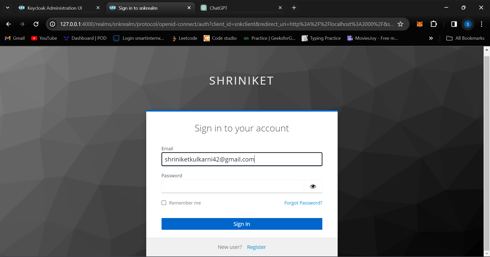
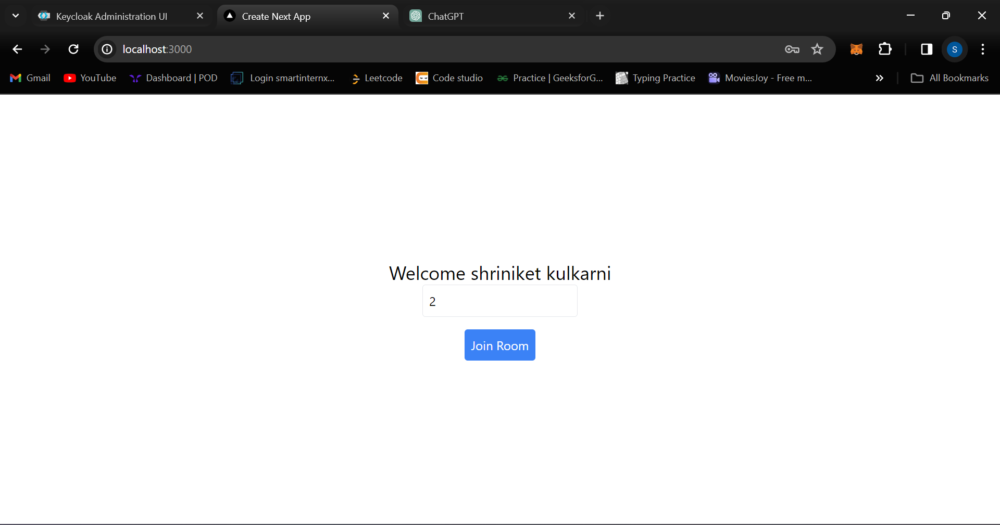
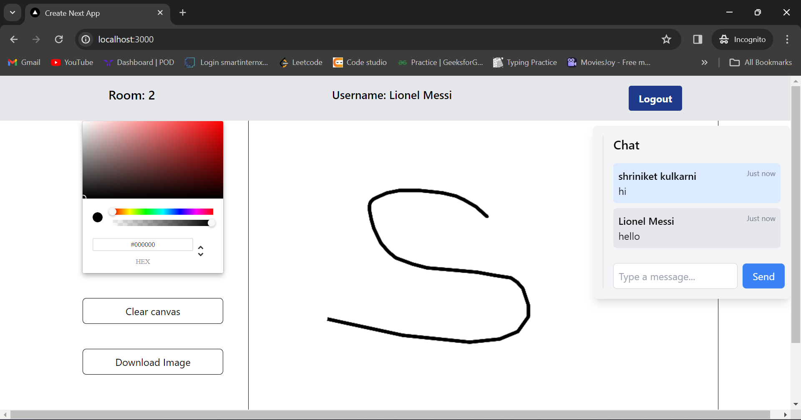
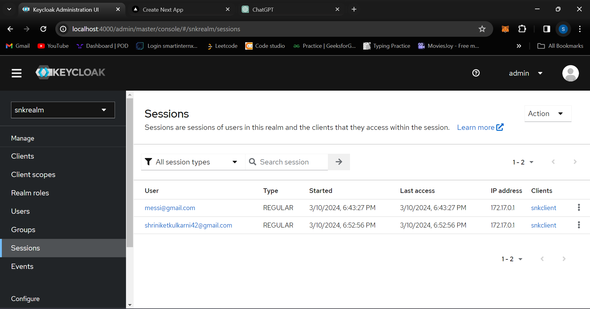

# Collaborative Whiteboard

## Demo Screenshots:

### Authentication using Keycloak

### Enter a room.

### Room 2

### Keycloak Dashboard

## About

This project is a collaborative whiteboard application built to facilitate real-time collaboration on a shared canvas. It incorporates features like live chat functionality to enhance communication among users within the application.

## Features

- Built with a Next js front end and a Node.js and Express back end.
- Utilizes Socket.io for real-time collaboration.
- Implements live chat functionality to enable real-time communication among users.
- Users can join specific rooms to collaborate with others in the same room.
- Each room has its own shared whiteboard where users within the same room can collaborate.

## How to Use

1. Clone the repository.
2. Install dependencies using `npm install`.
3. Start the server using `npm run dev`.
4. Open the application in your preferred web browser.
5. Choose or create a room to join.
6. Begin collaborating in real-time with others on the shared canvas and use the chat feature to communicate within the room.

## Technologies Used

- Next js
- Typescript
- Node.js
- Express
- Socket.io
- Keycloak

## Contributors

- [Shriniket Kulkarni](https://github.com/Shriniket007)

## License

This project is licensed under the [MIT License](LICENSE).
